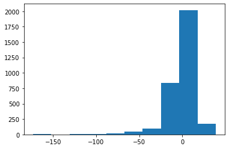

# Linear regression for FIFA 20 player market-vaulues 
#Dataset: https://www.kaggle.com/stefanoleone992/fifa-20-complete-player-dataset


```python
import tensorflow as tf
from keras.utils import np_utils
from keras.models import Sequential
from keras.layers import Dense
from sklearn.preprocessing import MinMaxScaler
import pandas as pd
import numpy as np
import matplotlib.pyplot as plt

#data subdirectory
dir = './data/'

#load data into df and remove players with zero market value
#exclude free transfer players 
df = pd.read_csv(dir + "players_20.csv")
df = df[df.value_eur != 0]
```

    Using TensorFlow backend.
    


```python
#histogramm: distribution of marketvalues
plt.hist(df.value_eur)
```


    (array([1.7168e+04, 5.7100e+02, 1.5600e+02, 6.3000e+01, 3.5000e+01,
            1.6000e+01, 9.0000e+00, 5.0000e+00, 3.0000e+00, 2.0000e+00]),
     array([1.0000e+04, 1.0559e+07, 2.1108e+07, 3.1657e+07, 4.2206e+07,
            5.2755e+07, 6.3304e+07, 7.3853e+07, 8.4402e+07, 9.4951e+07,
            1.0550e+08]),
     <a list of 10 Patch objects>)


```python
#number rows and columns
df.info()
```

    <class 'pandas.core.frame.DataFrame'>
    Int64Index: 18028 entries, 0 to 18277
    Columns: 104 entries, sofifa_id to rb
    dtypes: float64(16), int64(45), object(43)
    memory usage: 14.4+ MB
    


```python
#use only relevant columns
df = df[['sofifa_id','value_eur','age','height_cm','weight_kg','nationality','club','overall','potential','wage_eur','preferred_foot','international_reputation','weak_foot','skill_moves','work_rate','team_position','pace','shooting','passing','dribbling','defending','physic','attacking_crossing','attacking_finishing','attacking_heading_accuracy', 'attacking_short_passing', 'attacking_volleys', 'skill_dribbling', 'skill_curve', 'skill_fk_accuracy', 'skill_long_passing', 'skill_ball_control', 'movement_acceleration', 'movement_sprint_speed', 'movement_agility', 'movement_reactions', 'movement_balance', 'power_shot_power', 'power_jumping', 'power_stamina', 'power_strength', 'power_long_shots', 'mentality_aggression', 'mentality_interceptions', 'mentality_positioning', 'mentality_vision', 'mentality_penalties', 'mentality_composure', 'defending_marking', 'defending_standing_tackle', 'defending_sliding_tackle']]
df = df.dropna()
df = df[df.team_position != 'GK']
#tests were made with players only up to 15bn € market value
#modell needed less epochs, but loss went up 1%
#telling us that expensive player are rated more accurately
#df = df[df.value_eur < 15000000]
```


```python
df.info()
```

    <class 'pandas.core.frame.DataFrame'>
    Int64Index: 16032 entries, 0 to 18277
    Data columns (total 51 columns):
    sofifa_id                     16032 non-null int64
    value_eur                     16032 non-null int64
    age                           16032 non-null int64
    height_cm                     16032 non-null int64
    weight_kg                     16032 non-null int64
    nationality                   16032 non-null object
    club                          16032 non-null object
    overall                       16032 non-null int64
    potential                     16032 non-null int64
    wage_eur                      16032 non-null int64
    preferred_foot                16032 non-null object
    international_reputation      16032 non-null int64
    weak_foot                     16032 non-null int64
    skill_moves                   16032 non-null int64
    work_rate                     16032 non-null object
    team_position                 16032 non-null object
    pace                          16032 non-null float64
    shooting                      16032 non-null float64
    passing                       16032 non-null float64
    dribbling                     16032 non-null float64
    defending                     16032 non-null float64
    physic                        16032 non-null float64
    attacking_crossing            16032 non-null int64
    attacking_finishing           16032 non-null int64
    attacking_heading_accuracy    16032 non-null int64
    attacking_short_passing       16032 non-null int64
    attacking_volleys             16032 non-null int64
    skill_dribbling               16032 non-null int64
    skill_curve                   16032 non-null int64
    skill_fk_accuracy             16032 non-null int64
    skill_long_passing            16032 non-null int64
    skill_ball_control            16032 non-null int64
    movement_acceleration         16032 non-null int64
    movement_sprint_speed         16032 non-null int64
    movement_agility              16032 non-null int64
    movement_reactions            16032 non-null int64
    movement_balance              16032 non-null int64
    power_shot_power              16032 non-null int64
    power_jumping                 16032 non-null int64
    power_stamina                 16032 non-null int64
    power_strength                16032 non-null int64
    power_long_shots              16032 non-null int64
    mentality_aggression          16032 non-null int64
    mentality_interceptions       16032 non-null int64
    mentality_positioning         16032 non-null int64
    mentality_vision              16032 non-null int64
    mentality_penalties           16032 non-null int64
    mentality_composure           16032 non-null int64
    defending_marking             16032 non-null int64
    defending_standing_tackle     16032 non-null int64
    defending_sliding_tackle      16032 non-null int64
    dtypes: float64(6), int64(40), object(5)
    memory usage: 6.4+ MB
    


```python
#convert float values to int
df = df.fillna(0)
df.pace = df.pace.astype('int64')
df.shooting = df.shooting.astype('int64')
df.passing = df.passing.astype('int64')
df.dribbling = df.dribbling.astype('int64')
df.defending = df.defending.astype('int64')
df.physic = df.physic.astype('int64')
```


```python
#reset index because rows and columns were removed from pandas dataframe
df = df.reset_index()
df.head()
```


<div>
<style scoped>
    .dataframe tbody tr th:only-of-type {
        vertical-align: middle;
    }

    .dataframe tbody tr th {
        vertical-align: top;
    }

    .dataframe thead th {
        text-align: right;
    }
</style>
<table border="1" class="dataframe">
  <thead>
    <tr style="text-align: right;">
      <th></th>
      <th>index</th>
      <th>sofifa_id</th>
      <th>value_eur</th>
      <th>age</th>
      <th>height_cm</th>
      <th>weight_kg</th>
      <th>nationality</th>
      <th>club</th>
      <th>overall</th>
      <th>potential</th>
      <th>...</th>
      <th>power_long_shots</th>
      <th>mentality_aggression</th>
      <th>mentality_interceptions</th>
      <th>mentality_positioning</th>
      <th>mentality_vision</th>
      <th>mentality_penalties</th>
      <th>mentality_composure</th>
      <th>defending_marking</th>
      <th>defending_standing_tackle</th>
      <th>defending_sliding_tackle</th>
    </tr>
  </thead>
  <tbody>
    <tr>
      <td>0</td>
      <td>0</td>
      <td>158023</td>
      <td>95500000</td>
      <td>32</td>
      <td>170</td>
      <td>72</td>
      <td>Argentina</td>
      <td>FC Barcelona</td>
      <td>94</td>
      <td>94</td>
      <td>...</td>
      <td>94</td>
      <td>48</td>
      <td>40</td>
      <td>94</td>
      <td>94</td>
      <td>75</td>
      <td>96</td>
      <td>33</td>
      <td>37</td>
      <td>26</td>
    </tr>
    <tr>
      <td>1</td>
      <td>1</td>
      <td>20801</td>
      <td>58500000</td>
      <td>34</td>
      <td>187</td>
      <td>83</td>
      <td>Portugal</td>
      <td>Juventus</td>
      <td>93</td>
      <td>93</td>
      <td>...</td>
      <td>93</td>
      <td>63</td>
      <td>29</td>
      <td>95</td>
      <td>82</td>
      <td>85</td>
      <td>95</td>
      <td>28</td>
      <td>32</td>
      <td>24</td>
    </tr>
    <tr>
      <td>2</td>
      <td>2</td>
      <td>190871</td>
      <td>105500000</td>
      <td>27</td>
      <td>175</td>
      <td>68</td>
      <td>Brazil</td>
      <td>Paris Saint-Germain</td>
      <td>92</td>
      <td>92</td>
      <td>...</td>
      <td>84</td>
      <td>51</td>
      <td>36</td>
      <td>87</td>
      <td>90</td>
      <td>90</td>
      <td>94</td>
      <td>27</td>
      <td>26</td>
      <td>29</td>
    </tr>
    <tr>
      <td>3</td>
      <td>4</td>
      <td>183277</td>
      <td>90000000</td>
      <td>28</td>
      <td>175</td>
      <td>74</td>
      <td>Belgium</td>
      <td>Real Madrid</td>
      <td>91</td>
      <td>91</td>
      <td>...</td>
      <td>80</td>
      <td>54</td>
      <td>41</td>
      <td>87</td>
      <td>89</td>
      <td>88</td>
      <td>91</td>
      <td>34</td>
      <td>27</td>
      <td>22</td>
    </tr>
    <tr>
      <td>4</td>
      <td>5</td>
      <td>192985</td>
      <td>90000000</td>
      <td>28</td>
      <td>181</td>
      <td>70</td>
      <td>Belgium</td>
      <td>Manchester City</td>
      <td>91</td>
      <td>91</td>
      <td>...</td>
      <td>90</td>
      <td>76</td>
      <td>61</td>
      <td>88</td>
      <td>94</td>
      <td>79</td>
      <td>91</td>
      <td>68</td>
      <td>58</td>
      <td>51</td>
    </tr>
  </tbody>
</table>
<p>5 rows × 52 columns</p>
</div>


```python
#get train and test set
df_train=df.sample(frac=0.8,random_state=200) #random state is a seed value
df_test=df.drop(df_train.index)

```


```python
#split dataset into seperate datasets for categorical and numerical data 
df_nominal_train = df_train[['nationality','club','preferred_foot','work_rate','team_position']]
df_ordinal_train = df_train.drop(columns = ['nationality','club','preferred_foot','work_rate','team_position','sofifa_id','value_eur','index']) #zahlen mit rangordnung
df_solutions_train = df_train[['sofifa_id', 'value_eur']]

df_nominal_test = df_test[['nationality','club','preferred_foot','work_rate','team_position']]
df_ordinal_test = df_test.drop(columns = ['nationality','club','preferred_foot','work_rate','team_position','sofifa_id','value_eur','index']) #zahlen mit rangordnung
df_solutions_test = df_test[['sofifa_id', 'value_eur']]
```


```python
#Map categorical values to ids 
nationalities = df.nationality.unique()
nationalities_dict = dict(zip(nationalities, range(len(nationalities))))
clubs = df.club.unique()
clubs_dict = dict(zip(clubs, range(len(clubs))))
preferred_foots = df.preferred_foot.unique()
preferred_foots_dict = dict(zip(preferred_foots, range(len(preferred_foots))))
work_rate = df.work_rate.unique()
work_rate_dict = dict(zip(work_rate, range(len(work_rate))))
team_positions = df.team_position.unique()
team_positions_dict = dict(zip(team_positions, range(len(team_positions))))

df_nominal_train = df_nominal_train.replace({'nationality': nationalities_dict})
df_nominal_train = df_nominal_train.replace({'club': clubs_dict})
df_nominal_train = df_nominal_train.replace({'preferred_foot': preferred_foots_dict})
df_nominal_train = df_nominal_train.replace({'work_rate': work_rate_dict})
df_nominal_train = df_nominal_train.replace({'team_position': team_positions_dict})

df_nominal_test = df_nominal_test.replace({'nationality': nationalities_dict})
df_nominal_test = df_nominal_test.replace({'club': clubs_dict})
df_nominal_test = df_nominal_test.replace({'preferred_foot': preferred_foots_dict})
df_nominal_test = df_nominal_test.replace({'work_rate': work_rate_dict})
df_nominal_test = df_nominal_test.replace({'team_position': team_positions_dict})
```


```python
df_nominal_train.head()
```


<div>
<style scoped>
    .dataframe tbody tr th:only-of-type {
        vertical-align: middle;
    }

    .dataframe tbody tr th {
        vertical-align: top;
    }

    .dataframe thead th {
        text-align: right;
    }
</style>
<table border="1" class="dataframe">
  <thead>
    <tr style="text-align: right;">
      <th></th>
      <th>nationality</th>
      <th>club</th>
      <th>preferred_foot</th>
      <th>work_rate</th>
      <th>team_position</th>
    </tr>
  </thead>
  <tbody>
    <tr>
      <td>14383</td>
      <td>62</td>
      <td>90</td>
      <td>1</td>
      <td>2</td>
      <td>18</td>
    </tr>
    <tr>
      <td>13334</td>
      <td>10</td>
      <td>339</td>
      <td>1</td>
      <td>4</td>
      <td>18</td>
    </tr>
    <tr>
      <td>14944</td>
      <td>34</td>
      <td>157</td>
      <td>1</td>
      <td>4</td>
      <td>18</td>
    </tr>
    <tr>
      <td>15516</td>
      <td>14</td>
      <td>420</td>
      <td>1</td>
      <td>4</td>
      <td>13</td>
    </tr>
    <tr>
      <td>10006</td>
      <td>4</td>
      <td>471</td>
      <td>0</td>
      <td>4</td>
      <td>13</td>
    </tr>
  </tbody>
</table>
</div>


```python
#transform numerical values into the range 0 - 1
columns = df_ordinal_train.columns

scaler = MinMaxScaler()
df_ordinal_train = scaler.fit_transform(df_ordinal_train)
df_ordinal_test = scaler.transform(df_ordinal_test)

df_ordinal_train = pd.DataFrame(df_ordinal_train, columns=columns)
df_ordinal_test = pd.DataFrame(df_ordinal_test, columns=columns)
```


```python
df_ordinal_train.head()
```


<div>
<style scoped>
    .dataframe tbody tr th:only-of-type {
        vertical-align: middle;
    }

    .dataframe tbody tr th {
        vertical-align: top;
    }

    .dataframe thead th {
        text-align: right;
    }
</style>
<table border="1" class="dataframe">
  <thead>
    <tr style="text-align: right;">
      <th></th>
      <th>age</th>
      <th>height_cm</th>
      <th>weight_kg</th>
      <th>overall</th>
      <th>potential</th>
      <th>wage_eur</th>
      <th>international_reputation</th>
      <th>weak_foot</th>
      <th>skill_moves</th>
      <th>pace</th>
      <th>...</th>
      <th>power_long_shots</th>
      <th>mentality_aggression</th>
      <th>mentality_interceptions</th>
      <th>mentality_positioning</th>
      <th>mentality_vision</th>
      <th>mentality_penalties</th>
      <th>mentality_composure</th>
      <th>defending_marking</th>
      <th>defending_standing_tackle</th>
      <th>defending_sliding_tackle</th>
    </tr>
  </thead>
  <tbody>
    <tr>
      <td>0</td>
      <td>0.217391</td>
      <td>0.456522</td>
      <td>0.352941</td>
      <td>0.217391</td>
      <td>0.326087</td>
      <td>0.001773</td>
      <td>0.0</td>
      <td>0.50</td>
      <td>0.0</td>
      <td>0.647887</td>
      <td>...</td>
      <td>0.554217</td>
      <td>0.517647</td>
      <td>0.158537</td>
      <td>0.559524</td>
      <td>0.378049</td>
      <td>0.567901</td>
      <td>0.362319</td>
      <td>0.297619</td>
      <td>0.530864</td>
      <td>0.5250</td>
    </tr>
    <tr>
      <td>1</td>
      <td>0.217391</td>
      <td>0.804348</td>
      <td>0.568627</td>
      <td>0.260870</td>
      <td>0.413043</td>
      <td>0.000000</td>
      <td>0.0</td>
      <td>0.50</td>
      <td>0.0</td>
      <td>0.422535</td>
      <td>...</td>
      <td>0.060241</td>
      <td>0.658824</td>
      <td>0.646341</td>
      <td>0.154762</td>
      <td>0.195122</td>
      <td>0.320988</td>
      <td>0.188406</td>
      <td>0.571429</td>
      <td>0.654321</td>
      <td>0.6500</td>
    </tr>
    <tr>
      <td>2</td>
      <td>0.130435</td>
      <td>0.478261</td>
      <td>0.313725</td>
      <td>0.173913</td>
      <td>0.369565</td>
      <td>0.001773</td>
      <td>0.0</td>
      <td>0.50</td>
      <td>0.0</td>
      <td>0.169014</td>
      <td>...</td>
      <td>0.566265</td>
      <td>0.258824</td>
      <td>0.048780</td>
      <td>0.535714</td>
      <td>0.451220</td>
      <td>0.728395</td>
      <td>0.362319</td>
      <td>0.130952</td>
      <td>0.049383</td>
      <td>0.1125</td>
    </tr>
    <tr>
      <td>3</td>
      <td>0.000000</td>
      <td>0.782609</td>
      <td>0.705882</td>
      <td>0.108696</td>
      <td>0.478261</td>
      <td>0.000000</td>
      <td>0.0</td>
      <td>0.75</td>
      <td>0.0</td>
      <td>0.394366</td>
      <td>...</td>
      <td>0.144578</td>
      <td>0.470588</td>
      <td>0.487805</td>
      <td>0.321429</td>
      <td>0.207317</td>
      <td>0.271605</td>
      <td>0.188406</td>
      <td>0.440476</td>
      <td>0.530864</td>
      <td>0.5125</td>
    </tr>
    <tr>
      <td>4</td>
      <td>0.130435</td>
      <td>0.782609</td>
      <td>0.607843</td>
      <td>0.347826</td>
      <td>0.565217</td>
      <td>0.000000</td>
      <td>0.0</td>
      <td>0.50</td>
      <td>0.0</td>
      <td>0.577465</td>
      <td>...</td>
      <td>0.313253</td>
      <td>0.717647</td>
      <td>0.573171</td>
      <td>0.202381</td>
      <td>0.158537</td>
      <td>0.320988</td>
      <td>0.420290</td>
      <td>0.595238</td>
      <td>0.716049</td>
      <td>0.6875</td>
    </tr>
  </tbody>
</table>
<p>5 rows × 44 columns</p>
</div>


```python
#convert categorical values to numpy array
np_nat_train = np.array(np_utils.to_categorical(df_nominal_train.nationality))
np_club_train = np.array(np_utils.to_categorical(df_nominal_train.club))
np_pref_train = np.array(np_utils.to_categorical(df_nominal_train.preferred_foot))
np_work_train = np.array(np_utils.to_categorical(df_nominal_train.work_rate))
np_team_train = np.array(np_utils.to_categorical(df_nominal_train.team_position))

np_nat_test = np.array(np_utils.to_categorical(df_nominal_test.nationality))
np_club_test = np.array(np_utils.to_categorical(df_nominal_test.club))
np_pref_test = np.array(np_utils.to_categorical(df_nominal_test.preferred_foot))
np_work_test = np.array(np_utils.to_categorical(df_nominal_test.work_rate))
np_team_test = np.array(np_utils.to_categorical(df_nominal_test.team_position))
```


```python
print(np_nat_train[500])
```

    [0. 0. 0. 0. 0. 0. 0. 0. 0. 0. 0. 0. 0. 0. 0. 0. 0. 0. 0. 0. 0. 0. 0. 0.
     0. 0. 0. 0. 0. 0. 0. 0. 0. 0. 0. 0. 0. 0. 1. 0. 0. 0. 0. 0. 0. 0. 0. 0.
     0. 0. 0. 0. 0. 0. 0. 0. 0. 0. 0. 0. 0. 0. 0. 0. 0. 0. 0. 0. 0. 0. 0. 0.
     0. 0. 0. 0. 0. 0. 0. 0. 0. 0. 0. 0. 0. 0. 0. 0. 0. 0. 0. 0. 0. 0. 0. 0.
     0. 0. 0. 0. 0. 0. 0. 0. 0. 0. 0. 0. 0. 0. 0. 0. 0. 0. 0. 0. 0. 0. 0. 0.
     0. 0. 0. 0. 0. 0. 0. 0. 0. 0. 0. 0. 0. 0. 0. 0. 0. 0. 0. 0. 0. 0. 0. 0.
     0. 0. 0. 0. 0. 0. 0. 0. 0. 0. 0. 0. 0. 0. 0.]
    


```python
#merge all data into one big vector (for model performance only numerical values were used,
#if categorical and numerical columns were used along, the loss would be around 17% )
#np_nat_train, np_club_train, np_pref_train, np_work_train, np_team_train
train = np.hstack([df_ordinal_train])
test = np.hstack([df_ordinal_test])
sol_train = np.array(df_solutions_train.value_eur)
sol_test = np.array(df_solutions_test.value_eur)
```


```python
test.shape

```


    (3206, 44)


```python
train.shape
```


    (12826, 44)


```python
print(train[0])
```

    [0.2173913  0.45652174 0.35294118 0.2173913  0.32608696 0.00177305
     0.         0.5        0.         0.64788732 0.52564103 0.38235294
     0.45714286 0.36       0.57142857 0.46341463 0.54117647 0.51851852
     0.49275362 0.56962025 0.51851852 0.25301205 0.38095238 0.45205479
     0.41666667 0.65277778 0.64788732 0.5942029  0.30769231 0.6056338
     0.5125     0.52857143 0.67647059 0.54666667 0.55421687 0.51764706
     0.15853659 0.55952381 0.37804878 0.56790123 0.36231884 0.29761905
     0.5308642  0.525     ]
    


```python
#format of the solution dataset 
df_solutions_train.head()
```


<div>
<style scoped>
    .dataframe tbody tr th:only-of-type {
        vertical-align: middle;
    }

    .dataframe tbody tr th {
        vertical-align: top;
    }

    .dataframe thead th {
        text-align: right;
    }
</style>
<table border="1" class="dataframe">
  <thead>
    <tr style="text-align: right;">
      <th></th>
      <th>sofifa_id</th>
      <th>value_eur</th>
    </tr>
  </thead>
  <tbody>
    <tr>
      <td>14383</td>
      <td>233948</td>
      <td>180000</td>
    </tr>
    <tr>
      <td>13334</td>
      <td>232272</td>
      <td>280000</td>
    </tr>
    <tr>
      <td>14944</td>
      <td>240105</td>
      <td>140000</td>
    </tr>
    <tr>
      <td>15516</td>
      <td>248187</td>
      <td>110000</td>
    </tr>
    <tr>
      <td>10006</td>
      <td>251809</td>
      <td>700000</td>
    </tr>
  </tbody>
</table>
</div>


```python
#create the deep learning model
from keras import optimizers

model = Sequential()
model.add(Dense(256, activation="relu",input_dim=train.shape[1]))
model.add(Dense(64, activation="relu"))
model.add(Dense(32, activation="relu"))
model.add(Dense(1, activation="linear"))
model.compile(loss='mean_absolute_percentage_error',optimizer='adam')

#train the model
model.fit(train, sol_train, epochs=250, batch_size = 8 )
```

    Epoch 1/250
    12826/12826 [==============================] - 2s 122us/step - loss: 72.6323
    Epoch 2/250
    12826/12826 [==============================] - 1s 103us/step - loss: 66.5378
    Epoch 3/250
    12826/12826 [==============================] - 1s 104us/step - loss: 64.1988
    Epoch 4/250
    12826/12826 [==============================] - 1s 105us/step - loss: 59.4941
    Epoch 5/250
    12826/12826 [==============================] - 1s 102us/step - loss: 53.2732
    ...
    Epoch 10/250
    12826/12826 [==============================] - 2s 146us/step - loss: 33.7721
    ...   
    12826/12826 [==============================] - 1s 100us/step - loss: 15.8843
    Epoch 25/250
    ...
    Epoch 50/250
    12826/12826 [==============================] - 1s 102us/step - loss: 12.0775
    ...
    Epoch 100/250
    12826/12826 [==============================] - 1s 95us/step - loss: 10.0556
    ...
    Epoch 250/250
    12826/12826 [==============================] - 1s 103us/step - loss: 9.2848
    


    <keras.callbacks.callbacks.History at 0x159561c2588>


```python
#let the model predict the test values
preds = model.predict(test)  
```


```python
#calculate the loss of the test set with the solution set
abw = []
for i in range(len(preds)):
    abw.append(((sol_test[i] - int(preds[i])) / sol_test[i] * 100 )) 

summ = 0
for line in abw:
    if line < 0:
        line = line * -1
    summ = summ + line

print(summ / len(abw))

print(max(abw))
print(min(abw))
    
```

    10.059027271042448
    38.767589743589745
    -173.20374999999999
    


```python
#plot error distribution of the predictions
plt.hist(abw)
```


    (array([3.000e+00, 2.000e+00, 4.000e+00, 1.000e+01, 1.600e+01, 4.300e+01,
            9.800e+01, 8.340e+02, 2.019e+03, 1.770e+02]),
     array([-173.20375   , -152.00661603, -130.80948205, -109.61234808,
             -88.4152141 ,  -67.21808013,  -46.02094615,  -24.82381218,
              -3.62667821,   17.57045577,   38.76758974]),
     <a list of 10 Patch objects>)




